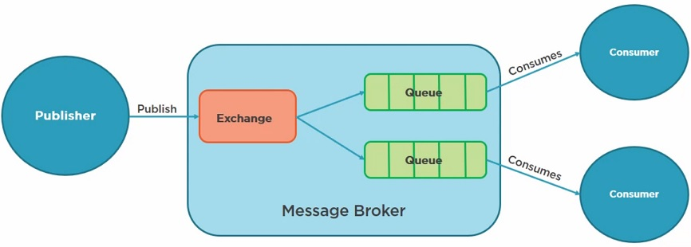

# Publisher and Subscriber

As mensagens são publicadas por um exchange em múltiplas filas. Cada fila ligada a esse exchange recebe uma cópia da mensagem. 
É utilizado o fanout exchange, que ignora routing keys.

