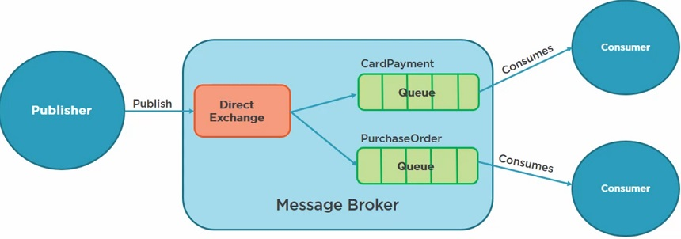

# Direct Routing

Onde uma exchange publica mensagens para diversas filas, associadas a uma routing key. Os consumers se escrevem em uma fila utilizando a routing key. Eles irão receber mensagem apenas da fila registraa.

